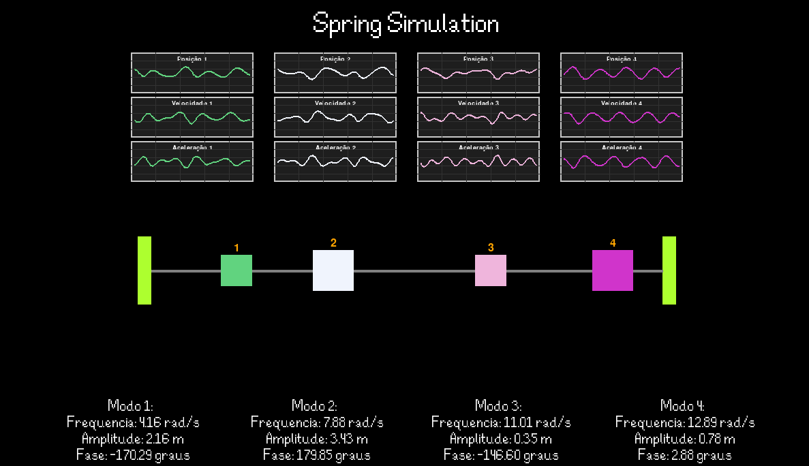

# Mass-Spring System Simulator with Walls


## Description

This project is an interactive simulation of a coupled mass-spring system, implemented in Python using the Pygame library. The simulation includes walls at both ends, connected to the masses by additional springs, allowing dynamic visualization of normal modes of vibration, their frequencies, amplitudes, and phases.

## Descrição

Este projeto é uma simulação interativa de um sistema de massas e molas acopladas, implementada em Python utilizando a biblioteca Pygame. A simulação inclui paredes nas extremidades, conectadas às massas por molas adicionais, permitindo a visualização dinâmica dos modos normais de vibração, suas frequências, amplitudes e fases.

## Features / Funcionalidades

- **System Configuration / Configuração Do Sistema:**
  Define the number of masses, mass values, spring constants, and initial position and velocity conditions.
  Defina o número de massas, valores das massas, constantes das molas e condições iniciais de posição e velocidade.

- **Normal Modes / Modos Normais:**
  Automatic calculation of normal modes, frequencies, amplitudes, and phases based on user inputs.
  Cálculo automático dos modos normais, frequências, amplitudes e fases com base nas entradas fornecidas.

- **Graphical Visualization / Visualização Gráfica:**
  Visual representation of masses and springs, including springs connecting walls to end masses.
  Representação visual das massas e molas, incluindo as molas que conectam as paredes às massas das extremidades.

- **Dynamic Graphs / Gráficos Dinâmicos:**
  Real-time visualization of positions, velocities, and accelerations of masses through graphs.
  Visualização em tempo real das posições, velocidades e acelerações das massas através de gráficos.

- **Pause:**
  Control the simulation with the `P` key to pause and resume the animation.
  Controle da simulação com a tecla `P` para pausar e retomar a animação.

## Screenshot / Captura de Tela




## Libraries Used / Bibliotecas Utilizadas

- **Python 3**
- **Pygame 2.6.1**
- **NumPy**
- **SciPy**

## Installation / Instalação


### Prerequisites / Pré-requisitos

Ensure you have Python 3 installed on your system. You can check the installed version with:

```bash
python3 --version
```
Steps to Install Dependencies / Passos para Instalar as Dependências
Clone the Repository / Clone o Repositório:

```bash
git clone https://github.com/RomuaIdo/Coupled-oscillations-python.git
cd Coupled-oscillations-python
```

Install the Required Libraries / Instale as Bibliotecas Necessárias:

```bash
pip install -r requirements.txt
```

Run the Simulation / Execute a Simulação:

```bash
python3 main.py
```

## Usage / Uso
Data Input / Entrada de Dados
- **Number of Masses / Número de Massas:** Enter the number of masses in the system.
- **Mass Values / Valores das Massas:** Enter the mass values.
- **Spring Constants / Constantes das Molas:** Enter the spring constants.
- **Initial Position / Posição Inicial:** Enter the initial position of the masses.
- **Initial Velocity / Velocidade Inicial:** Enter the initial velocity of the masses.

Control Keys / Teclas de Controle
- **P:** Pause and resume the simulation.

## How it Works / Como Funciona
Equations of Motion / Equações de Movimento:
As equações de movimento são derivadas da segunda lei de Newton, considerando as forças exercidas pelas molas. Isso resulta em um sistema de equações diferenciais acopladas que podem ser representadas em forma matricial como:
The equations of motion are derived from Newton's second law, considering the forces exerted by the springs. This results in a system of coupled differential equations that can be represented in matrix form as:


Normal Modes / Modos Normais:
Para resolver o sistema, são assumidas soluções harmônicas, levando a um problema de autovalores generalizado:
To solve the system, harmonic solutions are assumed, leading to a generalized eigenvalue problem:


Projection of Initial Conditions / Projeção das Condições Iniciais:
As condições iniciais de posição e velocidade são projetadas nos modos normais para determinar as amplitudes e fases de cada modo. Isso permite calcular a posição, velocidade e aceleração de cada massa em qualquer instante.
The initial position and velocity conditions are projected onto the normal modes to determine the amplitudes and phases of each mode. This allows calculating the position, velocity, and acceleration of each mass at any given time.
